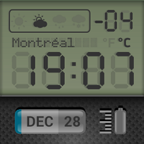

LCD Watch Face
=====================

Watch Face for SmartQ Z Smartwatch with 7-segment monochrome LCD look and a faux carbon-fibre panel. It also shows date, weather status, minimum temperature of the day and battery status of the smartwatch.

Screenshot
----------

Specifications
--------------
**Weather Indicators:**

_Sunny_, _cloudy_, _rain_ and _snow_ indicators are set based on weather conditions provided by the weather app. The small 7-segment display shows minimum temperature in celsius. However, the weather indicators seems to be not that good as the data provided by the API is inconsistent with that displayed in the default weather app. Something will be done soon about this though :)
The city name, _Montreal_ is a static display for now but there are plans to change that to dynamic city display soon (if there is demand)
Below the LCD, on the faux panel, the left glass indicator shows current month and date and the right icon is for battery status

**Battery:**

Battery status is displayed as 5 variants of the battery icon. When battery is below 5% the icon is empty. When it is below 25, its partially filled with red color. At other times, it gradually fills up (changes) at 50, 75 and then at 100%

**Display:**

Works on 240x240 resolution screens. Weather indicators may not work on devices with different hardware/APIs than those provided on SmartQ Z Watch

Installation
------------
Connect your Smartwatch, enable developer options (tapping Model Number 5 times under Settings->About). After installing Android SDK, go to `platform-tools` and check if the smartwatch is being shown :

    $ ./adb devices
    List of devices attached
    Indroid device
    
    $ ./adb install lcdwatchface.apk
    ...
    Success
    
After the installation is complete, the watch launcher will refresh and you will have the option to choose your new watchface :) Wait for a little while for the time and date to get displayed.

TODOs
-----
* Better and fool-proof weather indicators
* The plan is to have current temperature displayed instead of minimum temperature (on the right upper corner), however the API does not provide that by default so a workaround is required.
* ~~Battery Status indicator~~
* Multiple colors and faux backlighting (Timex Indiglo style) of the LCD

Credits
-------
1. [Rones](https://openclipart.org/detail/190202/lcd-by-rones-by-rones-190202) for LCD numerals
2. [http://dev.smartdevices.com.cn](dev.smartdevices.com.cn)